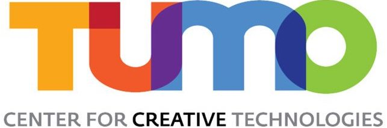

# TUMO workshop - Reading and computing music with AI

This Git contains main code and tasks for the TUMO workshop "Reading and computing music with AI", led by Chahan Vidal-Gorène (Calfa) and Baptiste Queuche (Calfa).

  

## Week 1: Optical Music Recognition (OMR)

**Goal**: Analyzing and recognizing scanned music scores to generate audio music files.

**Objectives**:
- Understand how neural networks work and their application to music recognition;
- Discover the main tasks in computer vision and their application to music;
- Learn how to build an AI project, annotate documents and train/evaluate a model.

**Data**: A specific focus will be made on Armenian music scores (mainly from Komitas).

Full instructions: see [week 1](week1/README.md).

## Week 2: Music Generation using AI (Generative Networks)