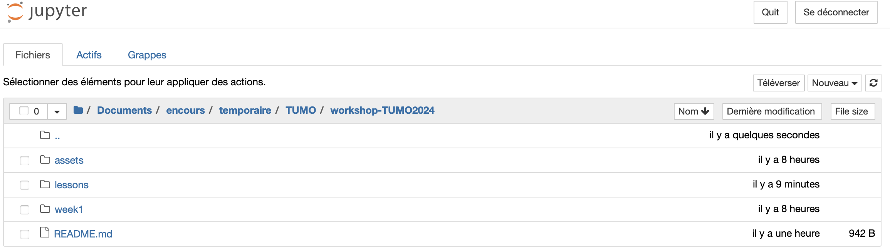

# Lesson 1 (week 1)

Objectives:
* Understand the basic workings of artificial intelligence;
* Create and define a datascience work environment;
* Learn to manage python environments for datascience;
* Learn to code and use Python functions.

## Deep learning experiments

[Level 1](https://playground.tensorflow.org/#activation=tanh&batchSize=10&dataset=gauss&regDataset=reg-plane&learningRate=0.03&regularizationRate=0&noise=25&networkShape=&seed=0.90161&showTestData=false&discretize=false&percTrainData=50&x=false&y=false&xTimesY=false&xSquared=false&ySquared=false&cosX=false&sinX=false&cosY=false&sinY=false&collectStats=false&problem=classification&initZero=false&hideText=false&playButton_hide=false&showTestData_hide=false&batchSize_hide=true&stepButton_hide=true&activation_hide=true&problem_hide=true&noise_hide=true&regularization_hide=true&learningRate_hide=false&regularizationRate_hide=true&dataset_hide=true)

[Level 2](https://playground.tensorflow.org/#activation=tanh&batchSize=10&dataset=circle&regDataset=reg-plane&learningRate=0.03&regularizationRate=0&noise=0&networkShape=&seed=0.86166&showTestData=false&discretize=false&percTrainData=50&x=false&y=false&xTimesY=false&xSquared=false&ySquared=false&cosX=false&sinX=false&cosY=false&sinY=false&collectStats=false&problem=classification&initZero=false&hideText=false&playButton_hide=false&showTestData_hide=false&batchSize_hide=true&stepButton_hide=true&activation_hide=true&problem_hide=true&noise_hide=true&regularization_hide=true&learningRate_hide=true&regularizationRate_hide=true&dataset_hide=true)

[Level 3](https://playground.tensorflow.org/#activation=tanh&batchSize=10&dataset=spiral&regDataset=reg-plane&learningRate=0.03&regularizationRate=0&noise=25&networkShape=&seed=0.62001&showTestData=false&discretize=false&percTrainData=50&x=false&y=false&xTimesY=false&xSquared=false&ySquared=false&cosX=false&sinX=false&cosY=false&sinY=false&collectStats=false&problem=classification&initZero=false&hideText=false&playButton_hide=false&showTestData_hide=false&batchSize_hide=true&stepButton_hide=true&activation_hide=true&problem_hide=true&noise_hide=true&regularization_hide=true&learningRate_hide=false&regularizationRate_hide=true&dataset_hide=true)

## Conda environments

Conda and its environments are a very good way to safely install and use python libraries on your computer. It's highly recommended to use Conda to avoid any system incompatibilities.

### Installation of Conda

[📌 official documentation](https://docs.anaconda.com/free/miniconda/index.html)

1. Download the latest Miniconda installer relevant for your operating system.

2. Open a **terminal**, execute the following command and **follow instructions**:

```bash
bash path/to/miniconda/installer
```

3. Close the **terminal** and open a new window.

✅ The `conda` command should now work (write `conda` and execute to verify).

❌ If not, try to install it again.

### Creating and using conda environments

1. Open a **terminal**.
2. Create an environment named `omr` with the following command:

```bash
conda create --name omr python=3.8
```

Note: `python=3.8` will install the 3.8 version of Python. You can of course force installation of an other version (`python=3.7`, `python=3.11`, etc.).

3. Once the environment is made, activate your environment with:

```bash
conda activate omr
```

✅ Do you see written `(omr)` on the left of your Terminal ? If yes, congratulations, you are now in a safe place to work.

❌ If not, try again to activate your environment or create a new one.

## Your workshop setup

1. Activate your `omr` environment.

2. Install python dependencies needed for the workshop:

```bash
pip install lxml
```
```bash
pip install midi2audio
```
```bash
pip install ultralytics
```
```bash
pip install muspy
```
```bash
conda install -c conda-forge jupyterlab
```
```bash
conda install -c conda-forge notebook
```
```bash
pip install git+https://github.com/BreezeWhite/oemer
```


✅ No installation problem? Good, you are now ready to do Optical Music Recognition.

❌ An error occured during the installation of a package. 💡 Copy paste on Google your error to see if someone has a solution on stackoverflow.

## Jupyter Notebook

The easiest way to run python and to experiment data science.

To run Jupyter Notebook:

1. In a new terminal window, activate your `omr` environment.

2. Launch jupyter notebook:

```bash
jupyter notebook
```

A new window will open in your browser, folder and files. You can now create a notebook to execute python code.

<p align="center">

</p>
