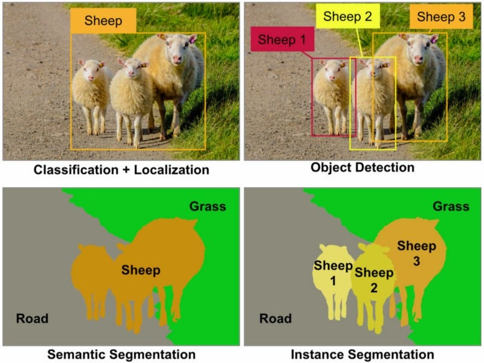

# Lesson 2 (week 1)

Objectives:

* Understanding differences and requirements for several Computer Vision tasks
* Learning to define guidelines for Object detection labeling
* Familiarizing yourself with Label Studio (for Computer Vision)
* Training a classification model

## Computer Vision tasks

<p align="center">

</p>

[source image](https://towardsdatascience.com/detection-and-segmentation-through-convnets-47aa42de27ea)


## Computer Vision with YOLO V8 (You Only Look Once)

*Official documentation* : [https://docs.ultralytics.com](https://docs.ultralytics.com)

* Tasks: classify, detect, segment, pose
* Model: Train, Predict

## Installing Label Studio

[Label Studio](https://labelstud.io) is a very versatile and user-friendly labeling tool, with various templates for multiple ML tasks (audio, text, image, etc.).

<p align="center">

</p>

1. Create an environment named `labelstudio` with the following command:

```bash
conda create --name labelstudio python=3.11
```

2. Activate your `labelstudio` environment.

3. Install python dependencies needed for the workshop:
```bash
pip install label-studio
```

4. Launching Label Studio:
```bash
label-studio
```

## Datasets for Image Classification using YOLO

**Dataset 1**: the CVC-MUSCIMA Database - writer identification task
[Download link](http://datasets.cvc.uab.es/muscima/CVCMUSCIMA_WI.zip)

**Dataset 2**: MUSCIMA++ - notes classification v0.9.1
[Download link](https://ufal.mff.cuni.cz/muscima/download)

**Preprocessing Python task 1**: Need to extract MUSCIMA++ images from XML annotations files.

**Preprocessing Python task 2**: Need to split datasets into train, val, test folders

From:
```
├── data/
│   ├── class_1/
│   ├── class_2/
│   ├── class_3/
│   ├── ...
│   ├── class_n/
```

to:
```
├── data/
│   ├── train/
|   |   |── class_1/ (70% of class_1 data)
|   |   |── class_2/ (70% of class_2 data)
|   |   |── ...
|   |   |── class_n/ (70% of class_n data)
│   ├── val
|   |   |── class_1/ (20% of class_1 data)
|   |   |── class_2/ (20% of class_2 data)
|   |   |── ...
|   |   |── class_n/ (20% of class_n data)
│   ├── test
|   |   |── class_1/ (10% of class_1 data)
|   |   |── class_2/ (10% of class_2 data)
|   |   |── ...
|   |   |── class_n/ (10% of class_n data)
```