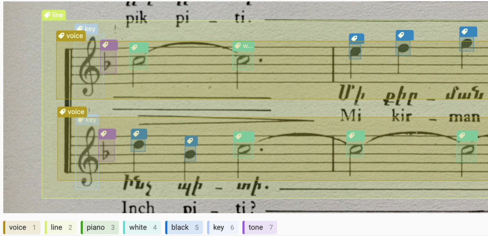

# Lesson 3 (week 1)

Objectives:

* Object detection labeling
* Coding a data split function
* Training an object dectection model and evaluating it

## The Komitas Dataset
[Download link](https://drive.google.com/drive/folders/1T01oMvwHWQ0y3VtXUr3DARhs-LJZwnyJ?usp=sharing)

### Annotation Guidelines

<p align="center">

</p>

List of training classes:
* `voice`
* `line`
* `piano`
* `white`
* `black`
* `key`
* `tone`

# Object detection training mode of YOLO

```python
model = YOLO('yolov8n')
results = model.train() # with params of your choices
```