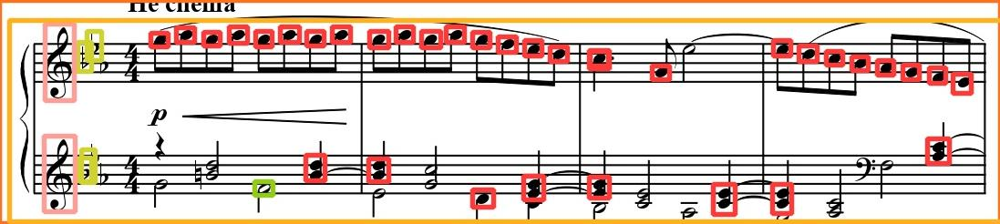

# Lesson 4 (week 1)

Objectives:

* Sharing data to increase training dataset
* Understanding training parameters and playing with them
* Coding a data split function
* Training a classification model

## Preliminary results of lesson 3 with a small dataset

<p align="center">

</p>

**Training**:
```python
model = YOLO('yolov8n')
results = model.train(data='path/to/config.yaml') # default configuration
```

Training parameters we can use:
* `imgsz`: to change input image size
* `dropout`: to avoid overfitting
* `epochs`: to increase/decrease number of epochs
* `lr0`: to change initial learning rate

For a full list of parameters:
[Click to see YOLOv8 documentation](https://docs.ultralytics.com/modes/train/#train-settings)

💡 Maybe have a look to data augment parameters? Something relevant for the task?

**Prediction**:
```python
model = YOLO('path/to/my/best/model.pt')
results = model.predict(source='path/to/test/image')
```

Prediction parameters we can use:

* `classes`: list of int, to predict only specific classes
* `source=0` and `show=True`, to use webcam
* `save_txt`: to export object coordinates
* `save_crop`: to crop objects

**Postprocessing Python task**: Need to sort detections from top-to-bottom

Some tips:
1. predict `lines` on a test image;
2. load in python the txt file with detected bouding-boxes;
3. parse the txt file to extract bouding-boxes: each line correspond to a detection `class_id x y width height`
4. convert `x` `y` `width` and `height` into a shapely compatible format
5. extract centroïd from shapely object
6. sort detections according to centroïds, from top to bottom
7. crop and export image with relevant filename (e.g. : 1_..., 2_...) using PILLOW


Update: Group solution

```python
from PIL import Image
import numpy as np
from shapely.geometry import box, Point
import os

def process_image_and_detections(image_path, detections_path):
    image = Image.open(image_path)
    image_width, image_height = image.size

    with open(detections_path, 'r') as file:
        lines = file.readlines()

    class_0_detections = [line.strip().split() for line in lines if line.startswith('0')]

    shapely_boxes = []
    centroids = []

    for detection in class_0_detections:
        _, x_center, y_center, width, height = map(float, detection)

        x_center = x_center * image_width
        width = width * image_width
        y_center = y_center * image_height
        height = height * image_height

        x_min = x_center - (width / 2)
        y_min = y_center - (height / 2)
        x_max = x_center + (width / 2)
        y_max = y_center + (height / 2)

        box_object = box(x_min, y_min, x_max, y_max)

        centroid = box_object.centroid

        shapely_boxes.append(box_object)
        centroids.append((centroid.x, centroid.y))

    sorted_boxes = [box for _, box in sorted(zip(centroids, shapely_boxes), key=lambda b: b[0][1])]

    for i, bbox in enumerate(sorted_boxes, 1):
        cropped_image = image.crop((bbox.bounds[0], bbox.bounds[1], bbox.bounds[2], bbox.bounds[3]))
        cropped_image.save(os.path.join(os.path.dirname(image_path), f"{i}_{os.path.basename(image_path)}"))

image_path = 'Downloads/ec94e196-Book02_00006.jpg'
detections_path = 'Downloads/ec94e196-Book02_00006.txt'

process_image_and_detections(image_path, detections_path)
```