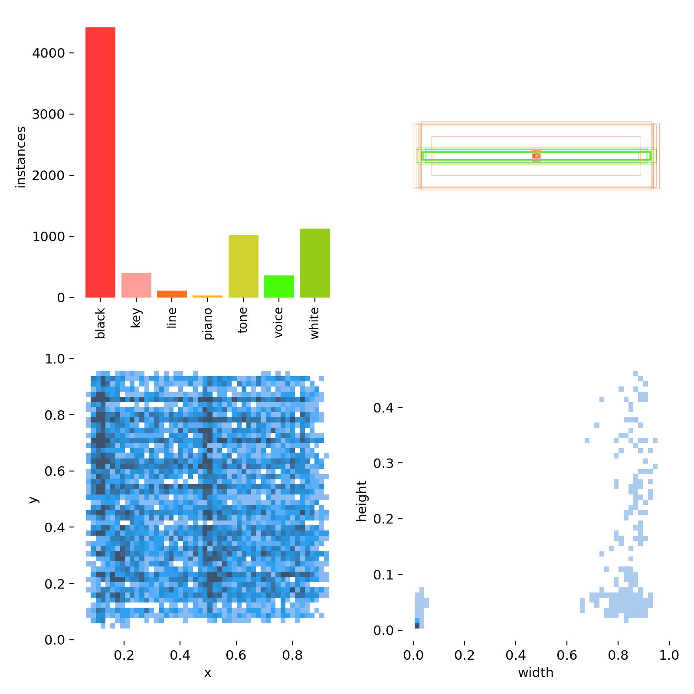
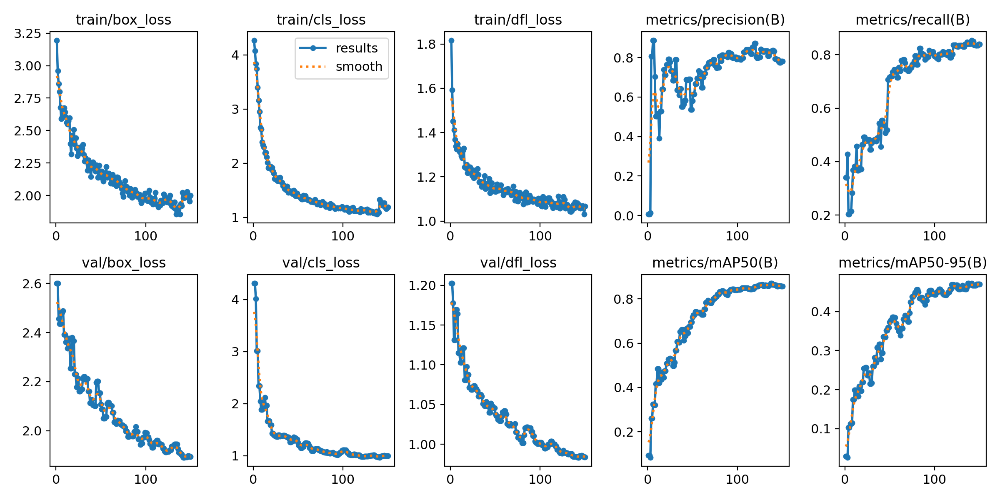
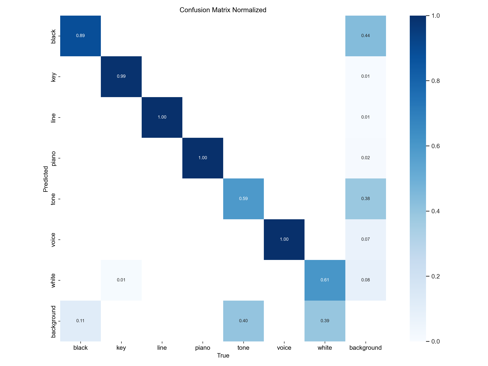
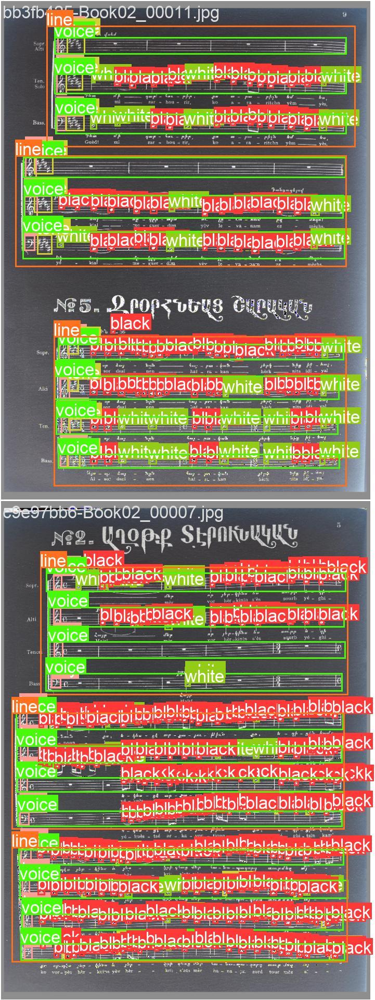
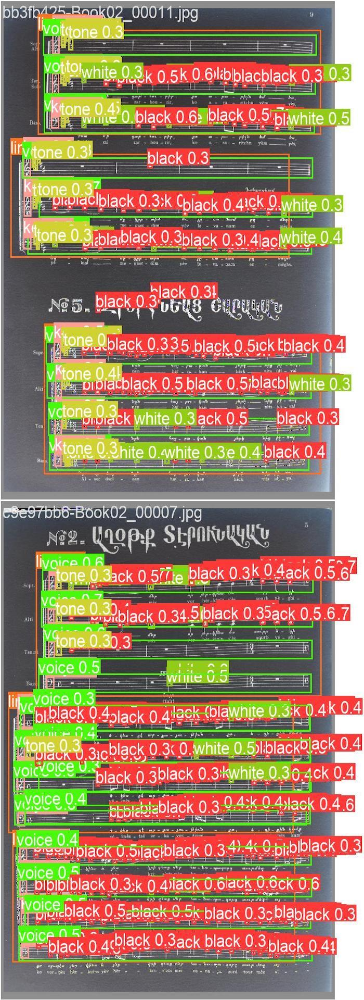
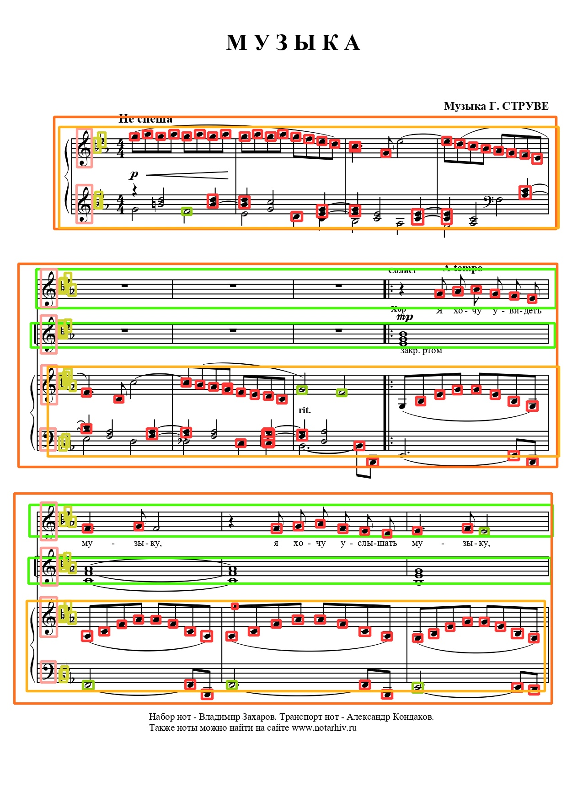

# Lesson 5 (week 1)

Objectives:

* Evaluating models
* Applying OMR on line crops / full music sheet (best strategy to choose)
* Using a music software to remix the generated audio
* Training a classification model

## Results of lesson 4 with the group dataset

All results and relevant informations are in the `runs/detect/train_ID` folder.

The `runs` folder is localized at the same level than your notebook.

### Dataset composition

<p align="center">

</p>

### Metrics curves

<p align="center">

</p>

### Training results by class

```
                 Class     Images  Instances      Box(P          R      mAP50  mAP50-95):
                   all         11       1913      0.887      0.891       0.91      0.514
                 black         11       1261      0.897      0.873      0.891      0.339
                   key         11        114      0.998      0.991      0.995      0.602
                  line         11         27      0.964      0.995      0.991      0.792
                 piano         11          6      0.861          1      0.995      0.649
                  tone         11        204      0.672      0.608      0.682      0.275
                 voice         11         99      0.935       0.99      0.993      0.628
                 white         11        202      0.878      0.777      0.825      0.311
```


### Confusion matrix

<p align="center">

</p>

### Ground Truth vs Prediction (validation dataset)

<p align="center">
 
</p>

### Example of prediction

<p align="center">

</p>

## OMR inference

### Detecting and predicting notes

Input: Image

Output: musicXML

```bash
oemer <img_path>
```

### Converting to MIDI file

Input: musicXML

Output: MIDI

```bash
python -c "import muspy ; music = muspy.read_musicxml('/path/to/musicXML/file') ; muspy.write_midi('/path/to/export/midi/file', music, backend='pretty_midi')"
```

### Using GarageBand to remix it a bit

TBD

## Image Classification using YOLO

```python
model = YOLO('yolov8n-cls') # classification
results = model.train() # with params of your choice
```

### Datasets

**Dataset 1**: the CVC-MUSCIMA Database - writer identification task
[Download link](http://datasets.cvc.uab.es/muscima/CVCMUSCIMA_WI.zip)

**Dataset 2**: MUSCIMA++ - notes classification v0.9.1
[Download link](https://ufal.mff.cuni.cz/muscima/download)

**Preprocessing Python task 1**: Need to extract MUSCIMA++ images from XML annotations files.

**Preprocessing Python task 2**: Need to split datasets into train, val, test folders

From:
```
├── data/
│   ├── class_1/
│   ├── class_2/
│   ├── class_3/
│   ├── ...
│   ├── class_n/
```

to:
```
├── data/
│   ├── train/
|   |   |── class_1/ (70% of class_1 data)
|   |   |── class_2/ (70% of class_2 data)
|   |   |── ...
|   |   |── class_n/ (70% of class_n data)
│   ├── val
|   |   |── class_1/ (20% of class_1 data)
|   |   |── class_2/ (20% of class_2 data)
|   |   |── ...
|   |   |── class_n/ (20% of class_n data)
│   ├── test
|   |   |── class_1/ (10% of class_1 data)
|   |   |── class_2/ (10% of class_2 data)
|   |   |── ...
|   |   |── class_n/ (10% of class_n data)
```
